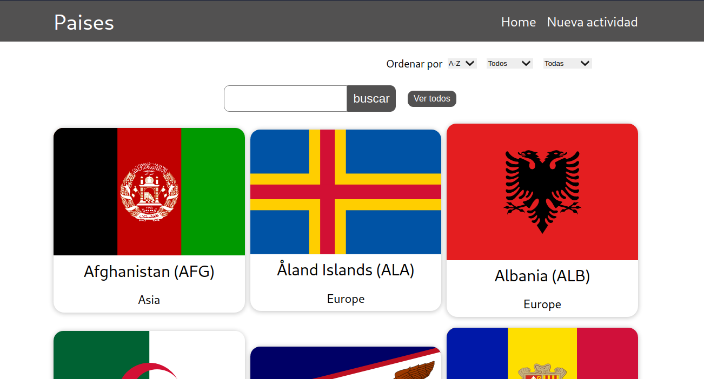
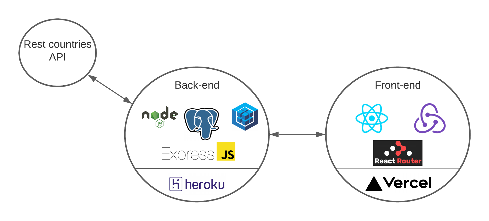

    

# Individual Project - Henry Countries

  

## ¿Que es capaz de hacer la aplicacion?

El proyecto tiene como idea principal 2 items:
- Poder filtrar, buscar y visualizar los paises de todo el mundo
- Vincular una actividad a distintos paises

## Que se utiliza en este proyecto

- Utilizancion de React, Redux, Node y Sequelize en conjunto.
- Realizacion de testings tando del back-end y del front-end
- Workflow de GIT, empleando pull request para cada caracteristica

## ¿Como esta distribuido el proyecto?

Esta distribuido en dos partes, el back-end, que se encuentra alojado en Heroku es capaz de responder peticiones y en caso de que sea incapaz de hacerlo irá a una segunda fuente de informacion, una api de paises (restcountries.eu). En segundo lugar se tiene el front el cual se encarga de realizar toda la representacion visual al usuario realizando peticiones al back y asi obtener nueva informacion .

### Por que no se utilizaron los filtros de la api?

Por aprender!, los filtros necesarios se implementaron en el back-end, de esta manera solo se utilizaron dos rutas ofrecidas por la api

  - GET https://restcountries.eu/rest/v2/all
  - GET https://restcountries.eu/rest/v2/name/{name}

## Puedes ver el proyecto en vivo aquí!

### [paises-sanrinconr.vercel.app](https://paises-sanrinconr.vercel.app)